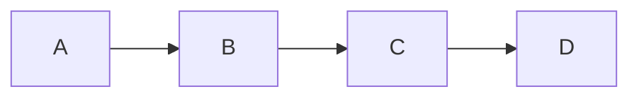
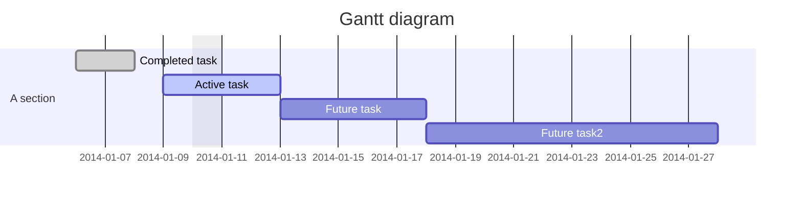
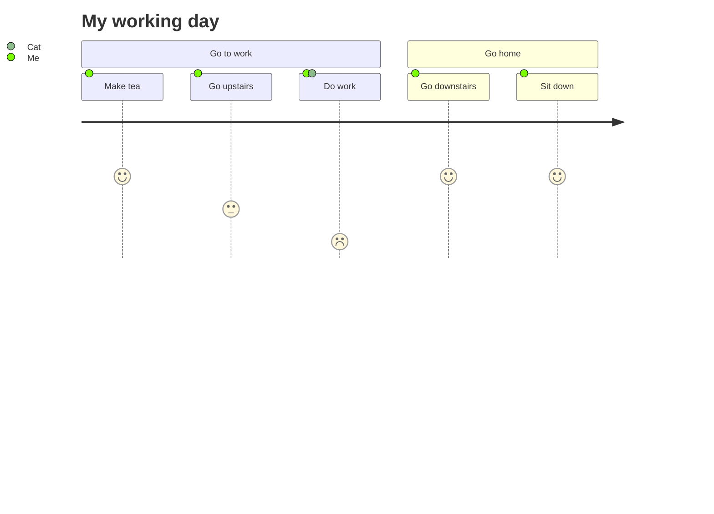

# Mermaid example

```mermaid

graph  TD;

  A --> B;
  A --> C;
  B --> D;
  C --> D;
```

```mermaid

flowchart LR;
    A-->B;
    B-->C;
    C-->D;
    click A callback "Tooltip for a callback"
    click B "http://www.github.com" "This is a tooltip for a link"
    click A call callback() "Tooltip for a callback"
    click B href "http://www.github.com" "This is a tooltip for a link"
```

```mermaid
  gantt
  dateFormat YYYY-MM-DD
  title Gantt diagram
  excludes weekdays 2014-01-10
  
  section A section
  Completed task :done,   des1, 2014-01-06,2014-01-08
  Active task    :active, des2, 2014-01-09,3d
  Future task    :        des3, after des2, 5d
  Future task2   :        des4, after des3, 10d
```

```mermaid
  journey
    title My working day
    section Go to work
      Make tea: 5: Me
      Go upstairs: 3: Me
      Do work: 1: Me, Cat
    section Go home
      Go downstairs: 5: Me
      Sit down: 5: Me
```

More examples at https://mermaid-js.github.io/mermaid/.
